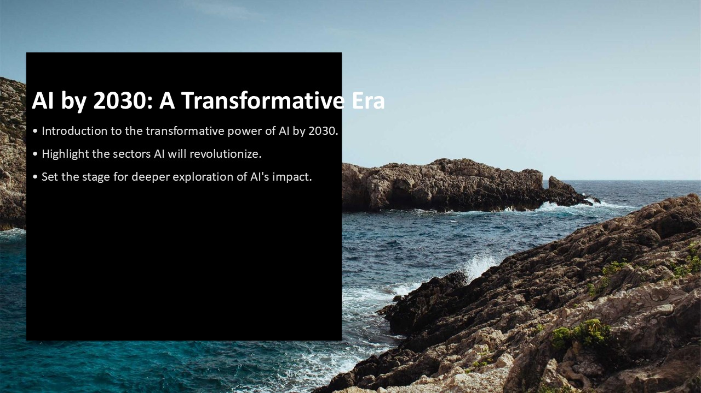
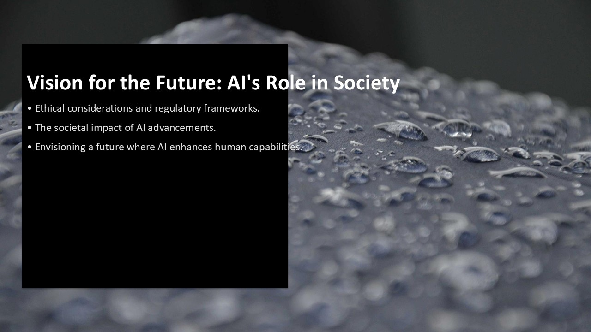

# Agentic AI PowerPoint Generator

This is an autonomous agent workflow that, for a given topic, builds a professional PowerPoint presentation with 4K images and charts and also speaker notes.

## Tech Stack
- **Agents Orchestration:** CrewAI
- **Presentation Building Agent:** python-pptx
- **LLM:** GPT-4o-mini
- **Search tools:** Serper Dev & Picsum

## Setup
1. Clone the repo.
2. Install dependencies: `pip install -r requirements.txt`
3. Create a `.env` file with your keys (OPENAI_API_KEY and SERPER_API_KEY)
4. python3 main.py

Here you find an example of generated presentation!

### Slide 1: Title (Cinematic)

### Slide 2: Market Data (Data Visualization)

### Slide 3: Vision (Cinematic)

   
